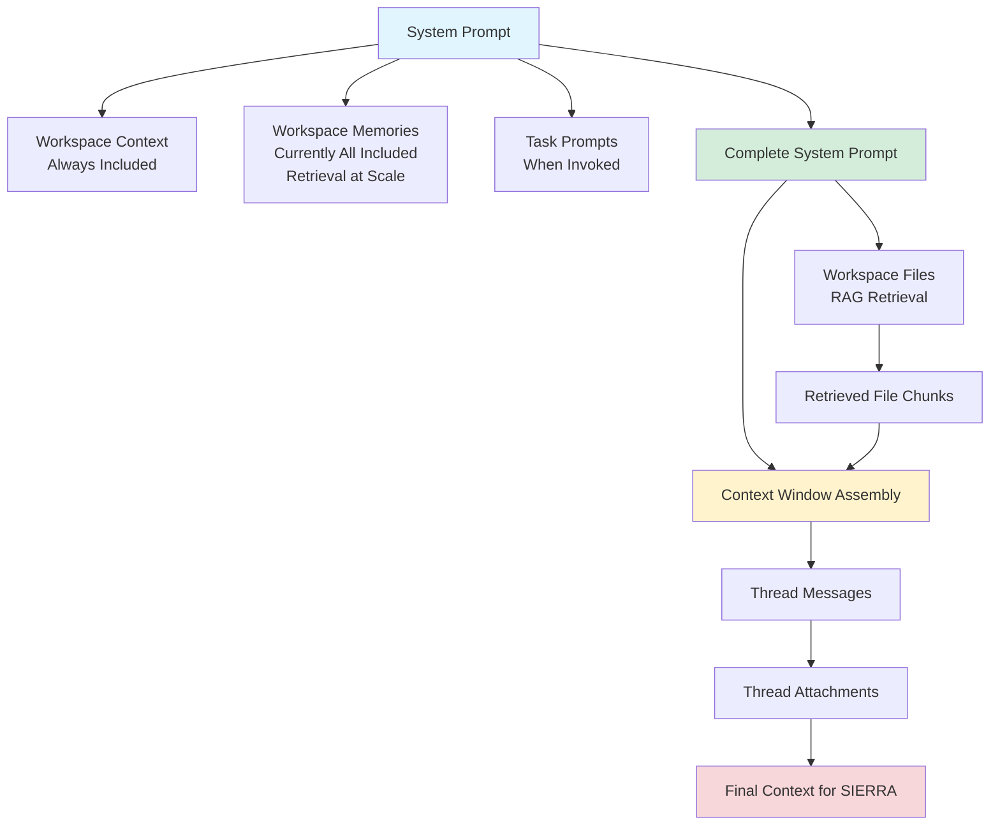

Now that you've seen the new workspace features, let's explore **when to use each one** and **how they technically work** under the hood. Understanding the mechanics will help you build more effective workspaces.

## The Four Context Layers: A Technical Overview

Every message SIERRA processes in a workspace is assembled from multiple context sources. Here's how they stack up:

**[Diagram suggestion: Visual hierarchy showing System Prompt → Workspace Context → Workspace Memories → Task Prompts (when invoked) → Workspace Files (RAG) → Thread Messages → Thread Attachments]**



### Understanding the System Prompt

**This is critical:** Workspace Context, Workspace Memories, and Task Prompts (when invoked) all feed into the system prompt that SIERRA receives. They're not separate—they're combined into a single instruction set at the beginning of every message.

**What this means in practice:**

- If you save something as a Memory, you don't need to also add it to Context—both are already in the system prompt
- When you invoke a Task Prompt, its instructions are added to the system prompt for that thread
- SIERRA sees all three sources as unified guidance, not competing instructions

**Important caveat about Memories at scale:** When a workspace accumulates a large number of Memories, we'll implement retrieval-based selection to prevent system prompt bloat. SIERRA will search stored Memories and include only those semantically relevant to the current thread. This keeps the system prompt efficient while still making historical knowledge accessible.

**However, Context is always fully included.** No retrieval, no filtering—every word of your Workspace Context appears in every system prompt. This is why Context should be reserved for truly universal, always-relevant guidance.

**[Diagram suggestion: Technical architecture showing Context (always included) + Memories (all included initially, retrieval-based at scale) + Task Prompt (when invoked) = System Prompt]**

### 1. Workspace Context (System Prompt - Always Included)

**Technical behavior:** Injected directly into the system prompt at the beginning of every thread in the workspace. Always present, never retrieved, never filtered.

**Token impact:** Always included at full length. If your context is 500 tokens, that's 500 tokens in every single message, guaranteed.

**Use when:**

- Information applies to 100% of threads in the workspace
- You need guaranteed presence without retrieval uncertainty
- The guidance is stable and doesn't change frequently
- You're defining the workspace's purpose, scope, or universal standards

**Don't use when:**

- Information is task-specific (use Task Prompts instead)
- Content is frequently updated or evolving (use Memories instead)
- Only some threads need the information
- You're tempted to write "if the user asks about X, do Y" (that's a Task Prompt)

**Example Context:**

plaintext

Unwrap Copy

```
This workspace supports the Engineering Standards Review team. 
All documents should be evaluated against ABS Rules Part 1, 
Chapter 3. Assume the user is familiar with maritime classification 
terminology unless they indicate otherwise. Use precise technical 
language—do not oversimplify.
```

### 2. Workspace Memories (System Prompt - Included with Future Retrieval)

**Technical behavior:** Currently injected into the system prompt alongside Context. When a workspace has many Memories, retrieval logic will select the most relevant ones for each thread to prevent prompt bloat.

**Token impact:** Currently always included like Context. At scale, only retrieved Memories will be included, but this happens automatically—users don't need to manage it.

**Use when:**

- Context evolves as work progresses (e.g., "We decided to use Method B for all structural calculations")
- You want to capture shared knowledge discovered during workspace use
- Information is broadly relevant but wasn't known when the workspace was created
- You need to remember preferences, definitions, or decisions that apply going forward

**Don't use when:**

- Information should be guaranteed present in every thread (use Context instead)
- The information is only relevant to one person's threads (personal memory doesn't exist in workspaces)
- You're saving procedural instructions (use Task Prompts instead)
- The memory is project-specific ephemera that won't matter in 3 months

**Example Memory:**

plaintext

Unwrap Copy

```
Client prefers all deliverables in metric units with SI notation. 
The project scope was expanded on 2/15/26 to include ballast 
system review.
```

**Key distinction between Context and Memories:**

- **Context** is set by workspace admins, defines what the workspace is for, and is _always fully included_
- **Memories** accumulate over time from all users, capture what the team has learned, and will eventually use _retrieval-based inclusion_ at scale
- **Both feed into the same system prompt**—you don't need to duplicate information between them

### 3. Task Prompts (System Prompt - Invoked)

**Technical behavior:** When a user invokes a Task Prompt, its full contents are injected into the system prompt for that thread. It joins Context and Memories as part of SIERRA's core instructions.

**Token impact:** Only when invoked. Once invoked, the Task Prompt becomes part of the system prompt for that thread and stays in the thread's context.

**Use when:**

- You have repeatable workflows that aren't always needed
- Different users perform different tasks in the same workspace
- Instructions are detailed and would bloat the system prompt if always included
- You want consistency across multiple executions of the same task type

**Don't use when:**

- Instructions apply to every single thread (put in Context instead)
- The "task" is really just asking SIERRA to search a file (just reference the file by name)
- Instructions are trivial or one-off

**Example Task Prompt:**

plaintext

Unwrap Copy

```
**Code Review Task**

1. Read the attached code file (thread attachment)
2. Review against the Coding_Standards.pdf (workspace file)
3. Check for:
   - Compliance with naming conventions (section 3.2 of standards)
   - Proper error handling patterns (section 5.1)
   - Security vulnerabilities (reference OWASP_Top_10.pdf workspace file)
4. Use File Search to cross-reference standards documents
5. Output findings in a table with columns: Line, Issue, Severity, Recommendation
6. Provide an overall compliance score
```

**Key advantage:** Task Prompts let you build a library of standard operating procedures without cluttering every thread with instructions that don't always apply. They become part of the system prompt on-demand.

### 4. Workspace Files (RAG Retrieval - Not System Prompt)

**Technical behavior:** Files are chunked, embedded, and stored in a vector database. When SIERRA processes a message, relevant chunks are retrieved via semantic search and injected into the context window _after_ the system prompt.

**Token impact:** Variable. Only retrieved chunks are included—typically a small fraction of the total file content. Retrieval is triggered by semantic similarity between your prompt and file chunks.

**Use when:**

- You have reference documents that are too large to include in the system prompt
- Different threads need different portions of the documents
- Content is factual and can be searched/retrieved (specifications, procedures, reports, data)
- You want to avoid wasting tokens on content that isn't always needed

**Don't use when:**

- The file contains critical instructions that must always be followed (extract those into Context or Task Prompts)
- The file is small enough to summarize in Context or a Memory
- You need guaranteed inclusion (RAG retrieval isn't 100% reliable)

**Retrieval optimization:**

- **Mention the file name explicitly** in your prompt: "According to the Q4_Safety_Report.pdf, what were the top findings?"
- **Reference files in Context or Task Prompts** to guide SIERRA: "Always consult Design_Standards_v3.docx when reviewing structural calculations"
- **Use descriptive file names** that match how users will reference them

**Example Files:**

- Project specifications (PDF)
- Historical analysis reports (DOCX)
- Reference standards or procedures (PDF)
- Data tables or calculation templates (XLSX)

**[Screenshot suggestion: Side-by-side comparison showing a prompt without file reference vs. with explicit file name mention, highlighting retrieval differences]**

## The System Prompt Architecture: How It All Comes Together

Here's what SIERRA actually sees when processing a message in your workspace:

**System Prompt Assembly:**

plaintext

Unwrap Copy

```
[Workspace Context - always included, full text]
+
[Workspace Memories - currently all included, retrieval-based at scale]
+
[Task Prompt - if invoked by user, full text]
=
Complete System Prompt
```

**Then added to context:**

plaintext

Unwrap Copy

```
[Complete System Prompt]
+
[Retrieved chunks from Workspace Files - if semantically relevant]
+
[Thread message history]
+
[Thread attachments - if present]
=
Final context for SIERRA to process
```

**Why this matters:**

1. **No duplication needed:** If you save a Memory saying "Client prefers metric units," you don't need to also edit the Context to add it. Both feed the same system prompt.
2. **Layered specificity:** Context provides universal baseline → Memories add discovered knowledge → Task Prompts add specific workflow instructions when needed → Files provide detailed reference material via retrieval.
3. **Token efficiency:** Task Prompts only consume tokens when invoked. Memories will eventually use retrieval at scale. Files always use retrieval. Only Context is guaranteed full inclusion every time.
4. **Consistent behavior:** Because all three (Context, Memories, Task Prompts) feed into the system prompt, SIERRA treats them with equal authority—they're not hierarchical, they're additive.

**[Diagram suggestion: Flow diagram showing message flow: User message → System assembles (Context + Memories + Task Prompt if invoked) → Retrieves relevant File chunks → Combines with thread history → SIERRA processes → Response]**

## Decision Framework: Which Feature Should I Use?

Here's a decision tree to guide your choices:

### Is this information needed in EVERY thread in the workspace?

- **Yes, and it must be guaranteed present with zero exceptions** → **Context**
- **Yes, but it was discovered/decided during workspace use** → **Memory**
- **No, only certain threads** → Keep reading

### Is this procedural instructions for a repeatable task?

- **Yes, and it will be performed multiple times but not in every thread** → **Task Prompt**
- **Yes, and it's always performed in every thread** → **Context**

### Is this a large document with factual reference material?

- **Yes, and different threads need different parts** → **Workspace File**
- **Yes, but one specific section is always critical** → **Extract that section into Context** + keep full file as Workspace File

### Is this content specific to one thread or one user?

- **Instructions for this specific task** → **Thread message** (just tell SIERRA what to do)
- **File relevant only to this task** → **Thread attachment**

**[Diagram suggestion: Flowchart showing this decision tree visually]**

## Technical Best Practices

### 1. Minimize System Prompt Bloat

Context is included in every message at full length. Memories are currently included in full and will use retrieval at scale. Be deliberate about what goes in the system prompt.

**Good Context** (concise, universal):

plaintext

Unwrap Copy

```
This workspace supports vessel structural analysis. Reference 
ABS_Steel_Vessel_Rules.pdf for all calculations. Use metric units.
```

**Bad Context** (bloated, task-specific):

plaintext

Unwrap Copy

```
This workspace supports vessel structural analysis. When performing 
stress analysis, first review section 3.2.1 of the rules, then 
calculate von Mises stress using the formula in section 3.2.4, 
then compare against allowable stress in Table 3-1. When performing 
fatigue analysis, first review section 3.3.1...
[continues for 1,500 tokens]
```

The bad example should be multiple Task Prompts, not Context.

### 2. Don't Duplicate Between Context and Memories

Because both feed into the system prompt, duplicating information wastes tokens.

**Don't do this:**

_Context:_

plaintext

Unwrap Copy

```
Use metric units for all calculations.
```

_Memory saved later:_

plaintext

Unwrap Copy

```
Reminder: use metric units for all calculations.
```

**Do this instead:**

_Context:_

plaintext

Unwrap Copy

```
Use metric units for all calculations unless otherwise specified.
```

_Memory saved later when exception arises:_

plaintext

Unwrap Copy

```
Project Bravo requires imperial units per client contract.
```

The Memory adds new information that modifies the general Context rule.

### 3. Explicit File References Beat Semantic Search

RAG retrieval is powerful but imperfect. The semantic similarity algorithm doesn't always retrieve exactly what you need.

**Weak prompt:**

plaintext

Unwrap Copy

```
What are the safety requirements?
```

SIERRA has to guess which file(s) might contain safety requirements and which chunks are relevant.

**Strong prompt:**

plaintext

Unwrap Copy

```
According to Safety_Procedures_2026.pdf section 4, what are 
the requirements for confined space entry?
```

The file name and section reference dramatically improve retrieval precision.

**Stronger still—put this in Context:**

plaintext

Unwrap Copy

```
When users ask about safety procedures, always reference 
Safety_Procedures_2026.pdf. For confined space questions, 
focus on section 4.
```

### 4. Task Prompts as Guardrails

Task Prompts aren't just instructions for SIERRA—they're also process documentation for humans. A well-written Task Prompt:

- Ensures consistency across team members
- Documents institutional knowledge
- Reduces variance in output quality
- Makes onboarding easier

Treat Task Prompts like runbooks. Include enough detail that someone unfamiliar with the process could execute it correctly.

### 5. Memory Hygiene

Because Memories persist in the system prompt (with eventual retrieval-based inclusion at scale), they need maintenance. Periodically review workspace Memories and delete outdated information.

**Good Memory:**

plaintext

Unwrap Copy

```
Client requires deliverables by end of Q1 2026. Use the updated 
risk matrix from Risk_Assessment_v2.xlsx.
```

**Memory that should be deleted after Q1 2026:**

plaintext

Unwrap Copy

```
Client requires deliverables by end of Q1 2026.
```

**Memory that should be updated:**

plaintext

Unwrap Copy

```
Use the updated risk matrix from Risk_Assessment_v3.xlsx.
```

Consider assigning one workspace admin to periodically audit Memories.

### 6. Thread Attachments for Ephemeral Inputs

If a file is only relevant to one task execution, use thread attachments. Examples:

- A contract you want reviewed once
- A dataset for one-time analysis
- A draft document for feedback

Thread attachments don't clutter the workspace for other users and are automatically available to SIERRA in that thread without retrieval uncertainty.

## Advanced: Layering Context Strategically

The most effective workspaces use all four context layers in concert:

**Example: Engineering Review Workspace**

**Context (universal, stable, always in system prompt):**

plaintext

Unwrap Copy

```
This workspace supports engineering drawing reviews for offshore 
platform projects. All reviews must comply with API RP 2A standards. 
Assume users are licensed professional engineers familiar with 
offshore structural design.
```

**Memories (evolving, project-specific, currently in system prompt, retrieval-based at scale):**

plaintext

Unwrap Copy

```
Current project: Stella Platform refurbishment. Client stakeholder 
is Maria Chen (maria.chen@stellaoil.com). Project uses imperial 
units per client preference.
```

**Workspace Files (reference material, retrieval-based):**

- API_RP_2A_22nd_Edition.pdf
- Stella_Platform_Original_Drawings.pdf
- Refurbishment_Scope_of_Work.docx

**Task Prompts (invoked workflows, added to system prompt when called):**

- "Structural Drawing Review" (detailed steps for reviewing structural drawings against API standards)
- "Weld Detail Review" (specific checklist for weld details, references section 7.3 of API RP 2A)
- "Load Path Analysis" (instructions for evaluating load paths, tells SIERRA to use File Search on original drawings)

**Thread Attachments (per task, always accessible in that thread):**

- Individual drawing file being reviewed in this specific thread

**How it works in practice:**

When an engineer opens a thread and invokes "Structural Drawing Review," SIERRA receives:

**System Prompt:**

- Context: Offshore platform + API RP 2A + PE-level language
- Memory: Stella project + Maria Chen + imperial units
- Task Prompt: Full structural drawing review checklist

**Context window:**

- Retrieved chunks from API_RP_2A file and original drawings (if mentioned)
- Thread attachment: The specific drawing being reviewed
- Thread message history

**Result:** SIERRA has universal guidance, project-specific context, detailed task instructions, relevant reference material, and the specific drawing—all without manual copying or repetition.

**[Screenshot suggestion: Example workspace showing all layers configured and a sample thread that demonstrates how they work together]**

## Troubleshooting Context Engineering

### "SIERRA isn't following my instructions"

- Check if instructions are in Context (always present) or buried in a File (requires retrieval)
- If critical, move instructions to Context or create a Task Prompt
- Verify users are invoking the relevant Task Prompt if applicable
- Remember: Context, Memories, and invoked Task Prompts all have equal authority in the system prompt

### "SIERRA isn't finding information in my files"

- Reference the file by name explicitly in your prompt
- Add a line to Context directing SIERRA when to use which files
- Check if the information is in a format SIERRA can parse (tables in images won't work well)
- Files use retrieval—they're not in the system prompt like Context/Memories/Task Prompts

### "The workspace feels cluttered/overwhelming"

- Move task-specific instructions from Context to Task Prompts
- Archive or remove outdated Memories
- Remove workspace Files that are no longer relevant—users can always use thread attachments for one-off needs

### "SIERRA's responses are inconsistent across team members"

- Create Task Prompts for activities that should be standardized
- Ensure critical information is in Context or Memories, not just told to SIERRA in individual threads
- Check if team members are using different phrasings that trigger different File retrievals
- Remember: invoked Task Prompts become part of the system prompt—make sure everyone knows which Task Prompts to use for which activities

### "I'm not sure if something should be Context or a Memory"

- **Context** = Set once, defines workspace purpose, guaranteed full inclusion always
- **Memory** = Discovered/decided over time, evolves with the project, will use retrieval at scale
- Both end up in the system prompt, so don't duplicate between them

## Conclusion: Context Engineering is Design Work

Building an effective workspace requires the same rigor as any other system design:

- **Define your requirements:** What does this workspace need to do?
- **Choose the right tools:** Context, Memories, Files, and Task Prompts each serve different purposes
- **Understand the architecture:** Context, Memories, and Task Prompts all feed the system prompt; Files use retrieval
- **Optimize for token efficiency:** Don't bloat the system prompt with conditional or task-specific content
- **Test and iterate:** Try different configurations and see what works
- **Maintain over time:** Audit Memories, update Context as scope changes, add new Task Prompts as processes mature

The new workspace features give you precise control over context engineering. Use them deliberately, and your team will have a powerful, consistent AI assistant tailored exactly to your work.

**Questions or want help designing your workspace? Reach out to the AI Center of Excellence.**